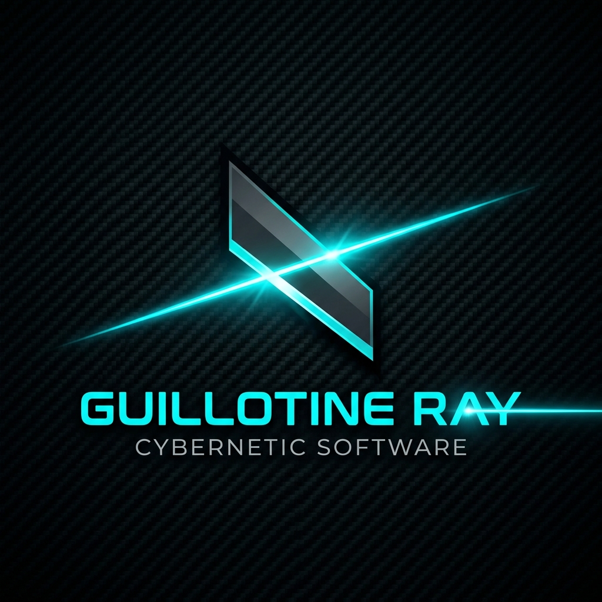

# Guillotine Ray ????

## ?? Download / ダウンロード
- **[GuillotineRay_v1.0.3.zip](https://github.com/iwa-kasoutuuuuuka/GuillotineRay/raw/main/releases/GuillotineRay_v1.0.3.zip)** (Windows 64-bit)

**Guillotine Ray** is a high-performance, precision-engineered screen monitoring and auto-clicking tool built with C# and OpenCV. Designed for stability and speed, it excels in complex automation tasks with DPI-aware accuracy and minimal CPU overhead.

[日本語の解説は以下にあります](#日本語)

---

## ?? Key Features

- **OpenCV Pattern Matching**: High-accuracy detection using `CCoeffNormed` algorithm.
- **Ultra-Low Latency**: Performance optimized with grayscale preprocessing and ROI-limited capture.
- **DPI Aware**: Fully compatible with multi-monitor setups and various scaling factors (100%, 125%, 150%, etc.).
- **Win32 SendInput**: Uses low-level input simulation to bypass common detection methods.
- **Emergency Stop**: Global hotkey (F8) to instantly halt operations.
- **Premium UI**: Modern dark-themed interface with real-time logging and debug visualization.

## ??? Architecture

- **.NET 8 / WinForms**: Modern runtime for Windows desktop engineering.
- **OpenCvSharp4**: Powerful computer vision wrapper.
- **Admin-Ready**: Includes application manifest to request required privileges.

## ?? How to Use

1. **Build**: Clone and build using Visual Studio or `dotnet build`.
2. **Templates**: Place target images (.png/.jpg) in a folder.
3. **ROI Selection**: Click "Set ROI" to drag-and-select your monitoring area.
4. **Execution**: Set your threshold (0.8 - 0.95) and interval, then hit "START".

---

## ???? 日本語概要

**Guillotine Ray** は、C# と OpenCV を駆使して開発された、高性能かつ精密なスクリーン監視・オートクリッカーです。安定性と速度を追求し、高DPI環境下でもピクセル単位の正確な動作を提供します。

### ?? 特徴
- **OpenCV テンプレートマッチング**: `CCoeffNormed` による高精度検出。
- **低負荷キャプチャ**: 関心領域（ROI）のみをスキャンし、CPU消費を最小化。
- **マルチモニター対応**: Windows のスケーリング設定を考慮した正確な座標計算。
- **管理者権限対応**: `SendInput` を確実に動作させるためのマニフェスト実装。
- **デバッグモード**: ヒット時のスクリーンショット保存とバウンディングボックス表示。

## ?? License
This project is licensed under the [MIT License](LICENSE).
